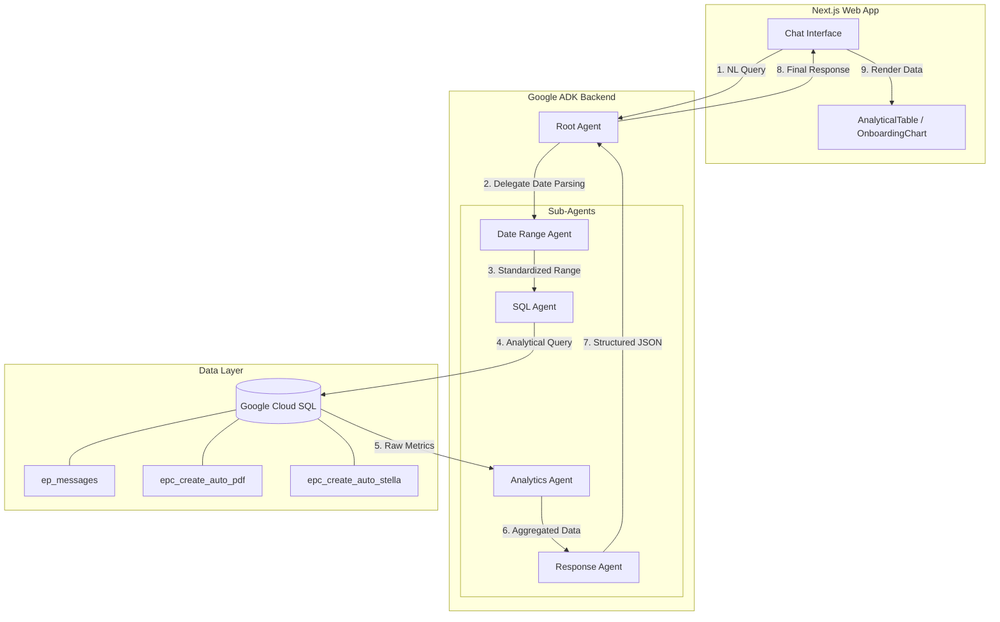

# UPC Onboarding Report Architecture

This diagram illustrates the flow of a user's analytical query through the multi-agent system and the retrieval of data from Google Cloud SQL.

### Flow Description
1. **NL Query**: The user asks a question like "Show me weekly onboarding for last month".
2. **Date Parsing**: The `Date Range Agent` parses "last month" into absolute start/end timestamps.
3. **SQL Generation**: The `SQL Agent` constructs and executes queries against the `ep_messages`, `epc_create_auto_pdf`, and `epc_create_auto_stella` tables.
4. **Aggregation**: The `Analytics Agent` computes totals and trends (e.g., daily counts, system distribution).
5. **Formatting**: The `Response Agent` packages the results into a structured JSON format suitable for chart rendering.
6. **Visualization**: The Next.js frontend detects the data structure and renders either an `AnalyticalTable` or an `OnboardingChart` using Recharts.
